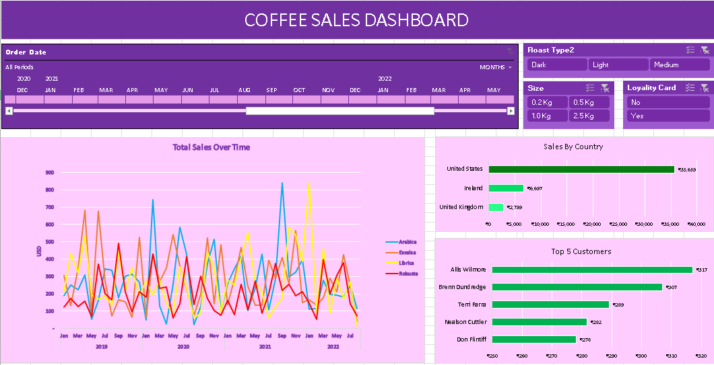

# 📊 Coffee Sales Dashboard - Excel

## 🧾 Overview

This Excel-based dashboard provides a detailed view of global coffee sales over a three-year period (2019–2022). It enables stakeholders to explore sales performance by product type, customer, size, country, and time using dynamic slicers and interactive visuals.

---

## 📌 Key Highlights

- **Top Country by Sales**: 🇺🇸 United States – **$35,633**  
- **Top Customer**: **Allis Wilmore – $817**  
- **Peak Sales Periods**: Recurring spikes in early and mid-year months  
- **Roast Types Analyzed**: Dark, Light, Medium  

---

## 📊 Dashboard Sections

### 1. Total Sales Over Time
- Line chart comparing monthly sales trends by coffee type (Arabica, Robusta, Excelsa, Liberica)  
- Visualizes seasonal trends and spikes across 2019–2022  

### 2. Sales by Country
- Bar chart of top-performing countries:  
  - **United States**, **Ireland**, and **United Kingdom**

### 3. Top 5 Customers
- Horizontal bar chart of highest-value customers:  
  - **Allis Wilmore**, **Brenn Dund Ridge**, **Tenil Farra**, **Nealson Cutler**, **Don Flintiff**

---

## 🕓 Filters/Controls

- **Order Date Slicer**: Filter by year and month (2019–2022)  
- **Roast Type**: Dark, Light, Medium  
- **Size Filter**: 0.2kg, 0.5kg, 1.0kg, 2.5kg  
- **Loyalty Card Filter**: Yes / No  

---

## 🛠 Tools Used

- **Microsoft Excel** – For dashboard creation and design  
- **Pivot Tables** – For data summarization  
- **Line & Bar Charts** – To visualize sales trends and comparisons  
- **Slicers** – To enable dynamic filtering  

---

## 📈 Key Insights

- **Arabica** and **Liberica** show frequent sales peaks  
- **United States** consistently leads in total sales  
- **Smaller pack sizes (0.5kg, 1.0kg)** are more popular  
- **Customers with loyalty cards** often have higher sales totals  

---

## 📎 Screenshot

---

## 📂 Files Included

- `CoffeeDashboard.xlsx` – Excel dashboard file  
- `Coffee.png` – Dashboard image  
- `README.md` – Documentation file  

---

## 🚀 How to Use

1. Clone or download this repository.  
2. Open the `CoffeeDashboard.xlsx` file using Microsoft Excel.  
3. Use the filters (Roast Type, Size, Loyalty Card, Date) to explore data.  
4. Analyze charts for sales trends and top customer insights.  

---

## 📬 Contact

For queries or suggestions, feel free to contact:  
📧 **dwivediaditya2322006@gmail.com**
